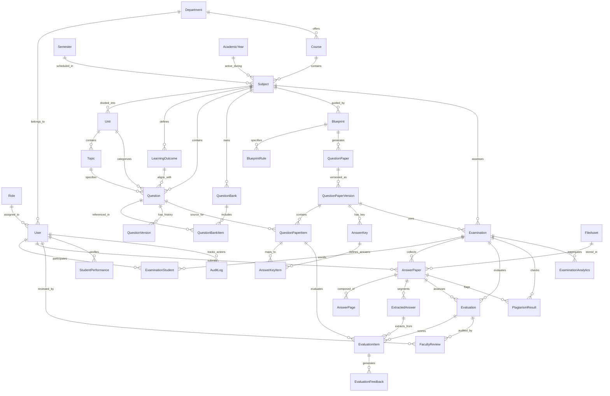

# AI ExamGen — Database Architecture & ER Diagram

## 1. Entity-Relationship Overview

AI ExamGen uses a normalized relational database schema powered by SQLAlchemy 2.0 with platform-independent GUID support (PostgreSQL `UUID` / SQLite `CHAR(36)`).



---

## 2. Core Domain Models Summary

### User & Academic Access
- `Role`: System roles (`ADMIN`, `FACULTY`, `STUDENT`).
- `User`: User profile with password hash, registration number, employee ID, and department mapping.
- `Department`, `Course`, `Semester`, `AcademicYear`: Multi-level academic hierarchy.
- `Subject`: Subject definition with credits, total units, and course alignment.
- `Unit`, `Topic`, `LearningOutcome`: Unit-level syllabus decomposition with Bloom taxonomy levels (`REMEMBER`, `UNDERSTAND`, `APPLY`, `ANALYZE`, `EVALUATE`, `CREATE`).

### Question Bank & Blueprint Engine
- `Question`: Question text, marks, type, difficulty (`EASY`, `MEDIUM`, `HARD`), Bloom level, expected answer, keywords (JSON), concepts (JSON).
- `QuestionBank` & `QuestionBankItem`: Subject question banks with unique constraints preventing duplicate question insertions.
- `QuestionVersion`: Complete historical versioning of modified questions.
- `Blueprint` & `BlueprintRule`: Section rules (Part A 10x2, Part B 5x13, Part C 1x15) specifying difficulty distribution and unit coverage.

### Paper & Answer Key Generation
- `QuestionPaper` & `QuestionPaperVersion`: Exam paper generation metadata and versioning.
- `QuestionPaperItem`: Contains `question_text_snapshot` to guarantee historical exam integrity even if the original question is later modified.
- `AnswerKey` & `AnswerKeyItem`: Model answers, expected keywords, concepts, and mark allocations.

### Examination & Student Submissions
- `Examination` & `ExaminationStudent`: Exam scheduling, duration, and student enrollment tracking.
- `FileAsset`: Centralized metadata for uploaded PDFs/images (syllabus, answer sheets, reports).
- `AnswerPaper`, `AnswerPage`, `ExtractedAnswer`: OCR page extractions and question-wise text segmentation.

### Multi-Layer AI Evaluation & Faculty Review
- `Rubric` & `RubricCriterion`: Step-wise grading criteria.
- `Evaluation` & `EvaluationItem`: Multi-layered evaluation scores (keyword, concept, semantic, pattern, rubric), AI marks, final marks, and confidence score.
- `EvaluationFeedback` & `FacultyReview`: AI generated student feedback and human-in-the-loop faculty mark overrides.
- `PlagiarismResult` & `AnswerSimilarity`: Flagged similarity pairs for faculty inspection.

### Analytics & Audit
- `ExaminationAnalytics` & `StudentPerformance`: Class-wide metrics (average, pass %, unit stats) and individual student topic profiles.
- `AuditLog`: Complete audit trail of system modifications.

---

## 3. Database Commands

```powershell
# Run Alembic migrations
python -m alembic upgrade head

# Seed database with realistic academic data
python scripts/seed_database.py
```
